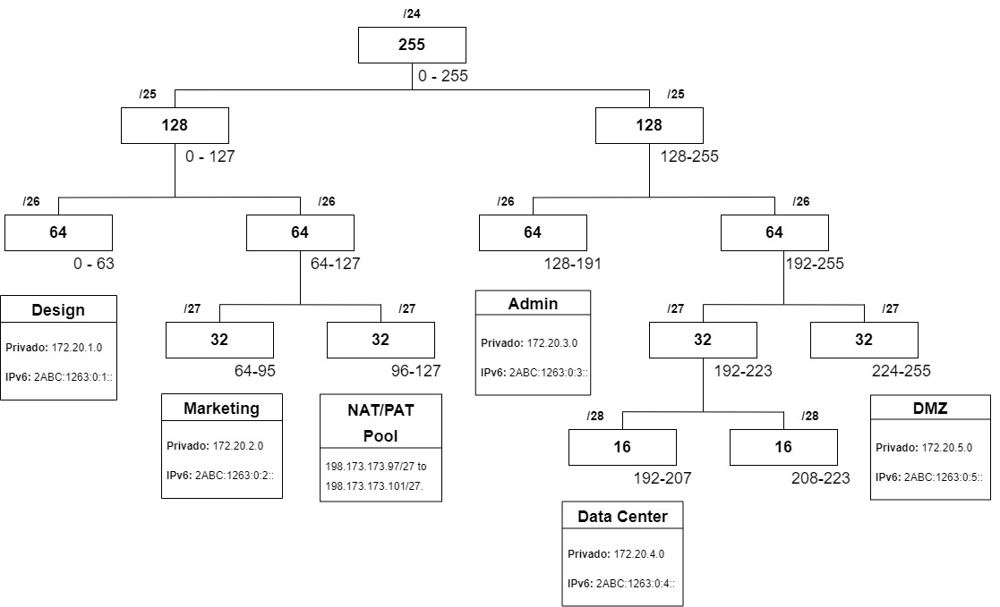
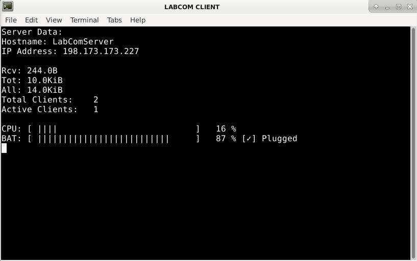

# projeto-rc1-2022

Project for Redes de Comunicações I

## Delivery 1

- *Report with network structure*

To see the network structre see [report](report/rc1_project_2022.pdf).

## Delivery 2

- *Configuration files for VPCs and Routers*

To see the configuration files for the VPCs and Routers go to [gns-configs](gns-configs).

## Delivery 3

- *DNS and HTTP configurations*

To see the DNS and HTTP config files, plus the websites, go to [server/dns](server/dns) and [server/http](server/http)

- *Client and Server aplications*

Files for Server VM and Client VM are respectively in [server](server) and [client](client) folders. Place them all in the home folder of each VM.

Each folder has a script **rc1_run.sh** that runs everything. This file can be placed anywhere (e.g. on Desktop to "double click to run")

The client shows data from the server.
